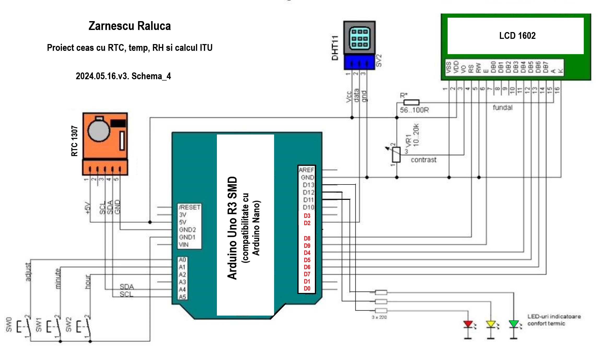

# Digital Clock

| | |
|-|-|
|`Author` | Zarnescu Raluca-Maria

## Description
For this project, I aim to create a versatile digital clock using readily available components like the Arduino UNO microcontroller, a 16x2 LED display, and a Real-Time Clock (RTC) module for precise timekeeping. 
The digital clock will not only display the current time but also offer additional features like showcasing the temperature, the thermal comfort index (ITU) and the quality of air (AQ).
It uses three buttons to set the time on the clock and 2 bands of addressable LEDs (Neopixel) to indicate through its various range of color the precalculated level of the ITU and AQ.

## Motivation
The motivation behind this project is to provide an accessible and educational example of integrating hardware components with the Arduino UNO microcontroller. 
By designing a digital clock, we aim to demonstrate the practical application of microcontrollers in everyday devices. 
Additionally, by incorporating features such as temperature, humidity and air quality readings, we enhance the utility of the digital clock, making it more than just a timekeeping device.

## Architecture

### Block diagram + Schematic

<!-- Make sure the path to the picture is correct -->

### Components

| Component | Description |
|---------|-------------|
| Placa UNO R3 | Main microcontroller board
| 16x2 LED display |	Display module for showcasing time, date, and more	
| RTC Module (DS1307 I2C) |	Module for accurate timekeeping	
| DHT11 Temperature and Humidity Sensor |	Digital sensor for environmental data	
| MQ 135 Detector | Detects harmful, toxic gases in the air
| Electrolytic Capacitor | Regulates the voltage
| Push Buttons or Rotary Encoder |	Input devices for user interaction	
| Breadboard and Jumper Wires	| Prototyping tools for circuit connections	
| Resistors and Capacitors |	Passive components for signal conditioning	
| Power Source | USB power adapter or battery pack	
| Enclosure | Protective housing for the project	
| Header Pins	| Male or female connectors for wiring	
| LEDs | Indicating different humidity levels (for ITU)
| Addressable LEDs (Neopixel) | Provide a wider range of colors for the ITU and AQ

### Libraries

<!-- This is just an example, fill in the table with your actual components -->

| Library | Description | Usage |
|---------|-------------|-------|
| LiquidCrystal | Library for controlling liquid crystal displays (LCDs) in Arduino projects  |  Used for controlling Liquid Crystal Displays (LCDs) by initializing the display and updating content. |
| DHT | Library for interfacing DHT series temperature and humidity sensors with Arduino | Used for accessing temperature and humidity data from DHT series sensors, initializing them, and retrieving sensor readings. |
| Adafruit Unified Sensor 1.1.14 | Abstraction layer for accessing various sensors with a unified method, simplifying sensor integration | Used for common functions to initialize sensors, read sensor data, and perform operations. |

## Log

<!-- write every week your progress here -->

### Week 6 - 12 May

### Week 7 - 19 May

### Week 20 - 26 May

## Reference links

<!-- Fill in with appropriate links and link titles -->

[Article 1](https://arduinotehniq.blogspot.com/2014/09/weather-station-manual-adjust-for-rtc.html#google_vignette)

[Article 2](https://ro.onetransistor.eu/2017/12/indice-confort-termic-dht11-arduino.html)

[Article 3](http://learn.adafruit.com/ds1307-real-time-clock-breakout-board-kit/)

[Article 4](http://nicuflorica.blogspot.ro/)

[Article 5](https://docs.arduino.cc/)

[Article 6](http://pesd.ro/articole/nr.1/Teodoreanu.pdf)

[Article 7](https://starea-vremii.ro/blog/ce-este-indicele-de-confort-termic-heat-index-si-cum-se-calculeaza)

[Article 8](https://www.winsen-sensor.com/product/mq135.html)

[Article 9](https://www.hackster.io/m_karim02/arduino-and-mq-135-gas-sensor-with-arduino-code-a8c1c6)

[Article 10](https://www.makerguides.com/air-pollution-monitoring-and-alert-system-using-arduino-and-mq135/)

[Article 11](https://www.instructables.com/How-to-Control-WS2812-RGB-LED-NeoPixel-W-Arduino-T/)

[Article 12](https://learn.adafruit.com/adafruit-neopixel-uberguide/arduino-library-use)
